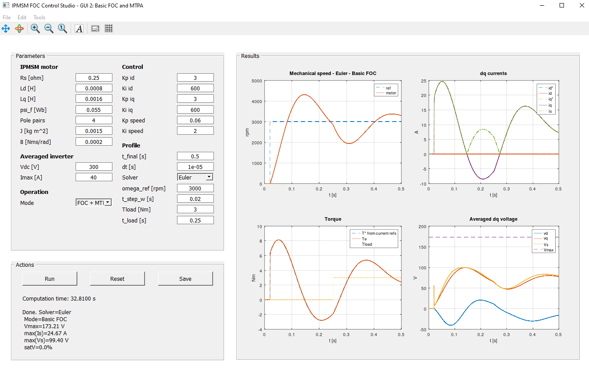

# IPMSM FOC + MTPA GUI in GNU Octave

This project implements an interactive Field-Oriented Control (FOC) simulation for an Interior Permanent Magnet Synchronous Motor (IPMSM) or Permanent Magnet Synchronous Motor (PMSM) drive using GNU Octave.

The goal of the project is to provide a clear and interactive educational tool for studying the dynamic behavior of a synchronous motor drive under vector control. The simulation uses a motor model in the rotating d-q reference frame, PI current controllers, a PI speed controller, an averaged voltage-source inverter model, and an optional Maximum Torque per Ampere (MTPA) current-reference block. High-frequency semiconductor switching is not modeled; instead, the inverter is represented by its maximum available voltage vector.

The graphical user interface allows the user to modify motor parameters, inverter limits, controller gains, reference speed, load torque, simulation time, operation mode, and numerical solver settings. Simulation results can be visualized directly in the GUI and exported for further analysis.

The current version compares two operation modes: **Basic FOC** with `id_ref = 0` and **FOC + MTPA**, where the current-reference generator computes `id_ref` and `iq_ref` to improve torque per ampere in salient IPMSM drives. Future extensions may include flux weakening, Maximum Torque per Voltage (MTPV), and operation maps in the d-q current plane.

## Features

- Basic FOC mode with `id_ref = 0`.
- FOC + MTPA mode for salient IPMSM drives.
- Outer speed PI controller.
- Inner `d`- and `q`-axis current PI controllers.
- MTPA current-reference generation based on `Ld`, `Lq`, `psi_f`, and `Is_ref`.
- Feedforward decoupling in the `dq` frame.
- Averaged voltage limiter based on the DC-link voltage.
- Fixed-step **Euler solver by default**.
- Fixed-step RK4 solver available from the GUI for comparison.
- Computation time indicator.
- Result export to MAT-file or CSV.
- Time-domain plots for speed, currents, torque, and voltage.
- Current plot with `id_ref`, `id`, `iq_ref`, `iq`, and stator-current magnitude `Is`.

## Requirements

- GNU Octave with GUI support.

No external Octave packages are required for the current version.

## How to run

Clone or download the repository, open Octave, and run:

```octave
cd path/to/ipmsm_foc_gui
main_gui_foc_mtpa
```

Press **Run** to execute the simulation. The default solver selected in the GUI is **Euler**. You can select **RK4** from the solver drop-down menu when you want a higher-order fixed-step integration method for comparison.

## Main file

- `main_gui_foc_mtpa.m`: complete GUI, model, controller, MTPA reference generator, solver, plotting, and export logic.

## Operation modes

The GUI supports two operation modes.

### Basic FOC

In Basic FOC mode, the direct-axis current reference is fixed to zero:

$$
i_d^* = 0
$$

The q-axis current reference is generated directly from the signed stator-current command produced by the speed controller:

$$
i_q^* = I_s^*
$$

This mode is simple, useful as a reference case, and suitable for non-salient PMSM operation.

### FOC + MTPA

In FOC + MTPA mode, the speed controller generates a signed stator-current magnitude command `Is_ref`. The MTPA block then computes `id_ref` and `iq_ref`.

For a salient IPMSM with `Lq > Ld`, the implemented MTPA expression is:

$$
i_d^* = \frac{\psi_f}{4\Delta L} - \sqrt{\left(\frac{\psi_f}{4\Delta L}\right)^2 + \left(\frac{I_s}{\sqrt{2}}\right)^2}
$$

The q-axis current reference is obtained from the current circle:

$$
i_q^* = \text{sign}(I_s^*)\sqrt{(I_s^*)^2 - (i_d^*)^2}
$$

If `Lq <= Ld`, the GUI falls back to Basic FOC:

$$
i_d^* = 0, \qquad i_q^* = I_s^*
$$

This fallback avoids applying a salient-IPMSM MTPA formula to a non-salient or differently salient machine.

## Solver selection

The GUI supports two fixed-step solvers:

- **Euler**: default solver. It is simple, fast, transparent, and useful for illustrating the sampled-time nature of a basic control simulation.
- **RK4**: optional fourth-order Runge-Kutta solver. It usually provides higher numerical accuracy for the same step size, but it requires more function evaluations per step.

The simulation step size is controlled by `dt [s]` in the **Profile** section.

## Averaged inverter model

The inverter is not modeled with PWM switching. Instead, the commanded d-q voltage vector is limited by:

$$
V_{\max} = \frac{V_{dc}}{\sqrt{3}}
$$

If the requested voltage magnitude exceeds this value, the voltage vector is scaled radially. This keeps the model focused on control behavior and avoids high-frequency switching effects.

## Exported results

The **Save** button can export:

- `.mat`: stores `results`, `params`, and `compute_time_s`.
- `.csv`: stores the time-series results in a spreadsheet-friendly format and creates an auxiliary `_params.mat` file containing `params` and `compute_time_s`.

Typical MAT-file usage in Octave:

```octave
data = load("ipmsm_foc_mtpa_results.mat");
plot(data.results.t, data.results.wm * 60/(2*pi));
grid on;
xlabel("Time [s]");
ylabel("Mechanical speed [rpm]");
```

Typical saved signals include:

```text
time, speed reference, motor speed,
id_ref, id, iq_ref, iq, Is_ref, Is,
torque reference, electromagnetic torque, load torque,
vd, vq, Vs, Vmax, voltage saturation flag, current saturation flag
```

## Screenshot

<p align="center">
  
</p>

## Repository structure

```text
.
├── main_gui_foc_mtpa.m
├── README.md
├── LICENSE
├── CHANGELOG.md
├── .gitignore
├── docs/
│   └── THEORY_FOC_MTPA.md
├── images/
│   └── gui_foc_mtpa.png
└── legacy/
    ├── main_gui_foc.m
    ├── THEORY_FOC.md
    └── gui_basic_foc.png
```

## Notes

The code is intentionally kept in one main `.m` file for the GUI. This makes the release easy to run, review, and share. Later versions can split the model, controller, solver, plotting, and GUI callbacks into separate files.

GUI 2 is an incremental extension of the basic FOC GUI. It keeps the averaged inverter and fixed-step simulation structure, while adding the MTPA current-reference generator and an operation-mode selector.

## License

This project is licensed under the MIT License. See the [LICENSE](LICENSE) file for details.
