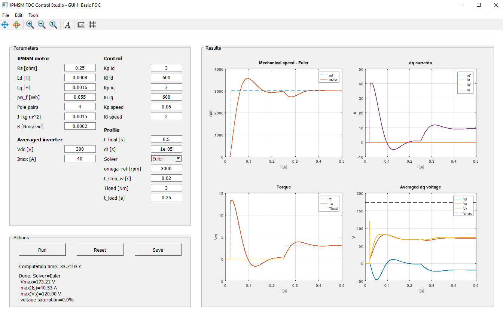

# IPMSM Basic FOC GUI in GNU Octave

This project implements a basic Field-Oriented Control (FOC) simulation for an Interior Permanent Magnet Synchronous Motor (IPMSM) or Permanent Magnet Synchronous Motor (PMSM) drive using GNU Octave.

The goal of the project is to provide a clear and interactive educational tool for studying the dynamic behavior of a synchronous motor drive under vector control. The simulation uses a motor model in the rotating $d\text{-}q$ reference frame, PI current controllers, a PI speed controller, and an averaged voltage-source inverter model. High-frequency semiconductor switching is not modeled; instead, the inverter is represented by its maximum available voltage vector.

The graphical user interface allows the user to modify motor parameters, inverter limits, controller gains, reference speed, load torque, simulation time, and numerical solver settings. Simulation results can be visualized directly in the GUI and exported for further analysis.

The current version focuses on basic FOC with $i_d^* = 0$. Future extensions may include Maximum Torque per Ampere (MTPA), flux weakening, Maximum Torque per Voltage (MTPV), and operation maps in the $i_d\text{-}i_q$ plane.

## Features

- Basic FOC with `id_ref = 0`.
- Outer speed PI controller.
- Inner `d`- and `q`-axis current PI controllers.
- Feedforward decoupling in the `dq` frame.
- Averaged voltage limiter based on the DC-link voltage.
- Fixed-step **Euler solver by default**.
- Fixed-step RK4 solver available from the GUI for comparison.
- Computation time indicator.
- Result export to MAT-file or CSV.
- Time-domain plots for speed, currents, torque, and voltage.

## Requirements

- GNU Octave with GUI support.

No external Octave packages are required for the current version.

## How to run

Clone or download the repository, open Octave, and run:

```octave
cd path/to/ipmsm_foc_gui
main_gui_foc_basic
```

Press **Run** to execute the simulation. The default solver selected in the GUI is **Euler**. You can select **RK4** from the solver drop-down menu when you want a higher-order fixed-step integration method for comparison.

## Main file

- `main_gui_foc_basic.m`: complete GUI, model, controller, solver, plotting, and export logic.

## Solver selection

GUI supports two fixed-step solvers:

- **Euler**: default solver. It is simple, fast, transparent, and useful for illustrating the sampled-time nature of a basic control simulation.
- **RK4**: optional fourth-order Runge-Kutta solver. It usually provides higher numerical accuracy for the same step size, but it requires more function evaluations per step.

The simulation step size is controlled by `dt [s]` in the **Profile** section.

## Exported results

The **Save** button can export:

- `.mat`: stores `results`, `params`, and `compute_time_s`.
- `.csv`: stores the time-series results in a spreadsheet-friendly format and creates an auxiliary `_params.mat` file containing `params` and `compute_time_s`.

Typical MAT-file usage in Octave:

```octave
data = load("ipmsm_foc_results.mat");
plot(data.results.t, data.results.wm * 60/(2*pi));
grid on;
xlabel("Time [s]");
ylabel("Mechanical speed [rpm]");
```

## Screenshot

<p align="center">
  
</p>

## Repository structure

```text
.
├── main_gui_foc_basic.m
├── README.md
├── LICENSE
├── CHANGELOG.md
├── .gitignore
└── docs/
|   └── THEORY_BASIC_FOC.md
└── images/
    └── gui_basic_foc.png
```

## Notes

The code is intentionally kept in one main `.m` file for GUI. This makes the first release easy to run, review, and share. Later versions can split the model, controller, solver, plotting, and GUI callbacks into separate files.

## License

This project is licensed under the MIT License. See the [LICENSE](LICENSE) file for details.
